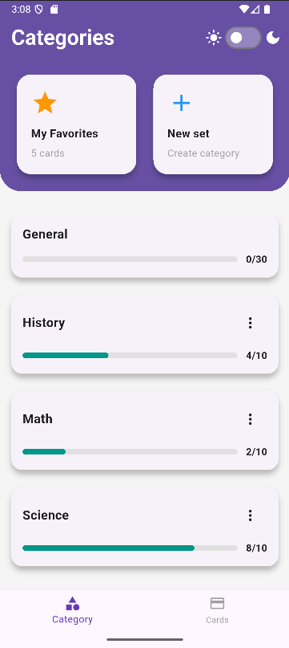
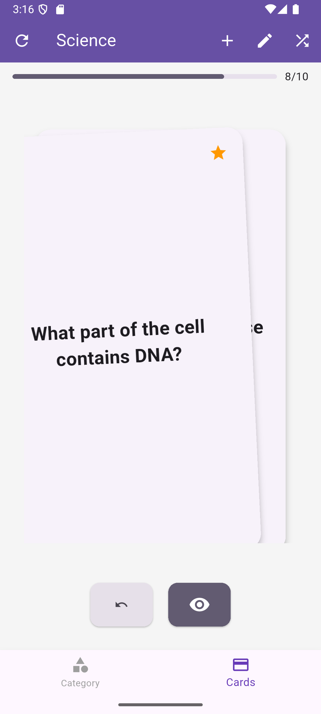
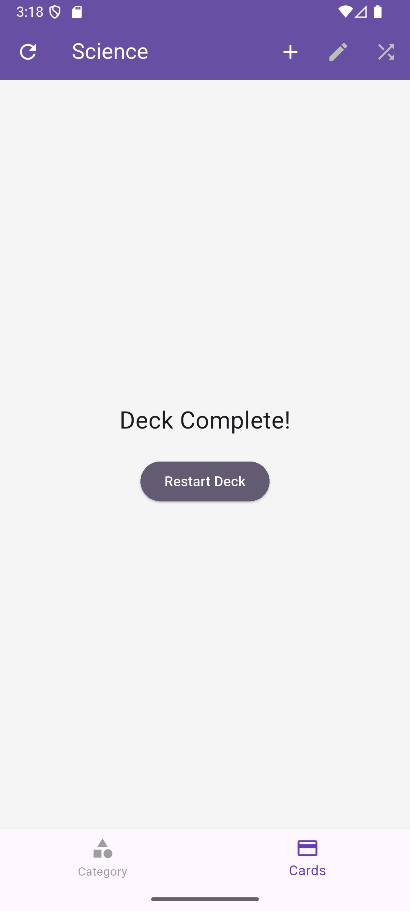
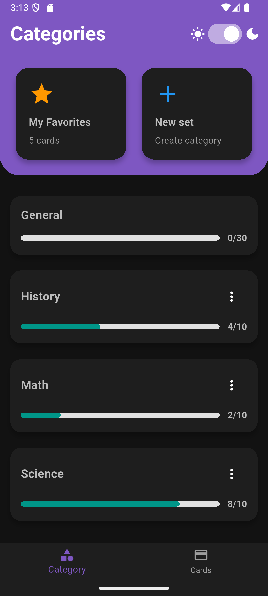
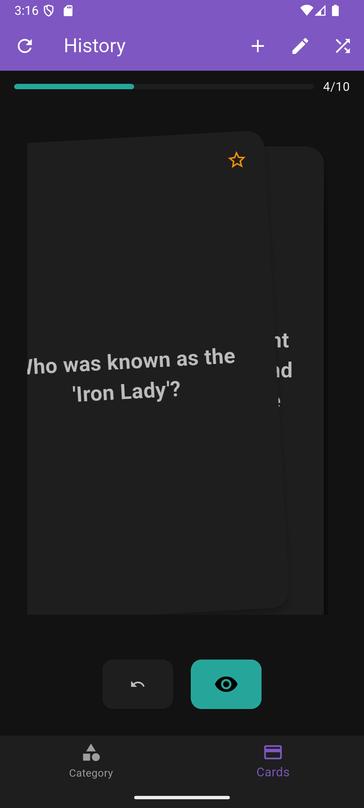
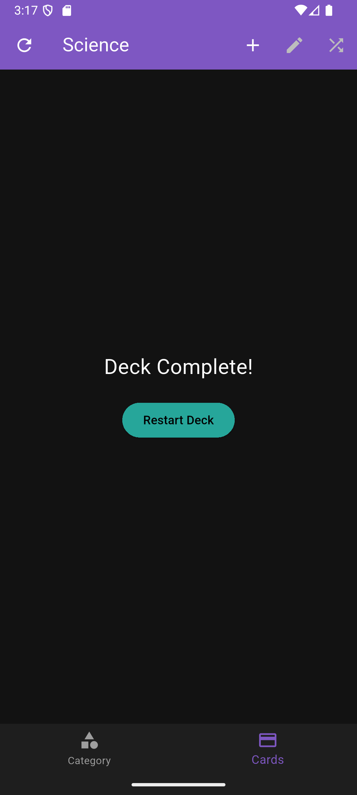

---

# 📚 Flashcards App

A simple and modern **Flashcards App** built with **Flutter** and **Hive** for local storage.
It allows you to create, edit, and review flashcards by category, mark favorites, and track progress.
Supports both **Light and Dark mode**. 🌙☀️

---

## Features

* 🗂️ **Categories**
  Organize flashcards into different categories (sets).

  * Predefined **General** category contains all cards.
  * Create and delete custom sets.

* ⭐ **Favorites**
  Mark any flashcard as a favorite and quickly access them in the **Favorites deck**.

* 📊 **Progress Tracking**

  * Tracks progress for each category.
  * Progress is saved locally using **SharedPreferences**.
  * Resumes where you left off.

* 🔀 **Card Management**

  * Add, edit, and delete flashcards.
  * Shuffle cards within a category.
  * Swipe through flashcards with smooth animations.

* 🎨 **Themes**

  * Built-in support for **Light and Dark mode**.
  * Follows system theme by default.
  * Toggle available directly in the Home screen.

---

## Tech Stack

* [Flutter](https://flutter.dev) (UI framework)
* [Hive](https://docs.hivedb.dev) (local NoSQL database for flashcards)
* [SharedPreferences](https://pub.dev/packages/shared_preferences) (for saving progress and settings)
* [Provider](https://pub.dev/packages/provider) (state management)

---

## State Management

This app uses **Provider** for state management.

* `ThemeProvider` manages light/dark theme switching.
* `CategoryProvider` manages categories and their progress.
* `FlashcardProvider` manages the flashcard deck, navigation, and favorites.

This ensures a **clean separation of concerns**:

* **UI (Screens/Widgets)** → listens to Providers
* **Providers** → handle state & expose data
* **Services/Repository** → perform business logic & database operations

---

## Screenshots

### Light Mode

| Home                                                | Flashcards                                               | Deck Complete                                               |
| --------------------------------------------------- | -------------------------------------------------------- | ----------------------------------------------------------- |
|  |  |  |

### Dark Mode

| Home                                               | Flashcards                                              | Deck Complete                                              |
| -------------------------------------------------- | ------------------------------------------------------- | ---------------------------------------------------------- |
|  |  |  |

---

## Getting Started

### 1. Clone the repository

```bash
git clone https://github.com/your-username/flashcard.git
cd flashcard
```

### 2. Install dependencies

```bash
flutter pub get
```

### 3. Run the app

```bash
flutter run
```

---

## Project Structure

```
lib/
│── main.dart                   # App entry point (sets up providers & themes)
│
├── data/
│   └── flashcard_repository.dart  # Hive repository for flashcards
│
├── model/
│   └── flashcard.dart             # Hive model for Flashcards
│
├── providers/
│   ├── category_provider.dart     # Provider for categories & progress
│   ├── flashcard_provider.dart    # Provider for flashcard decks
│   └── theme_provider.dart        # Provider for theme switching
│
├── screens/
│   ├── home_screen.dart           # Home screen (categories, favorites, theme toggle)
│   └── flashcard_screen.dart      # Flashcard deck screen
│
├── services/
│   ├── category_service.dart      # Business logic for categories
│   └── flashcard_service.dart     # Business logic for flashcards
│
├── theme/
│   └── app_theme.dart             # Centralized light & dark theme
│
└── widgets/
    ├── category_tile.dart         # Reusable tile for categories
    ├── favorite_card.dart         # Card for Favorites section
    ├── flashcard_widget.dart      # UI for flashcard front/back
    ├── new_set_card.dart          # UI card for creating a new set
    ├── theme_switcher.dart        # Light/Dark mode switcher
    └── top_section.dart           # Top section (Favorites + New Set)
```

---


